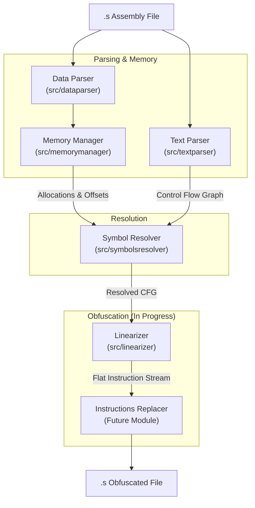

<file path="CONTRIBUTE.md">
# Contributing to Movfuscator

Welcome to the **Movfuscator** project! This document explains the architecture, testing process, and the roadmap for the unimplemented features (stubs).

## 1. Architecture Overview

The Movfuscator pipeline is designed to parse assembly code, resolve memory layout, and transform instructions into a `mov`-only format.

### System Diagram



### Core Components

1.  **Data Parser** (`src/dataparser`): Parses `.data` section directives (e.g., `.int`, `.asciz`) to identify variables.
2.  **Memory Manager** (`src/memorymanager`): Manages the linear memory layout. It allocates data, handles alignment padding, and tracks offsets relative to a global base.
3.  **Text Parser** (`src/textparser`): Parses the `.text` section into a Control Flow Graph (CFG) containing `BasicBlock` objects. It detects labels and instructions.
4.  **Symbol Resolver** (`src/symbolsresolver`): Bridges the gap between parsing and memory. It replaces symbolic references (e.g., `movl counter, %eax`) with absolute memory offsets (e.g., `__GLOBAL_MEM + 4`).
5.  **Linearizer** (`src/linearizer`): **(STUB)** Currently, this module flattens the CFG by serializing blocks and injecting `jmp` instructions where needed. *See Roadmap below for intended functionality.*
6.  **Instructions Replacer**: **(STUB)** A future module intended to replace standard instructions with `mov` sequences.

---

## 2. Roadmap & Stubs

The following components are currently stubs. Their implementation is the primary goal of the project.

### The Linearizer (`src/linearizer`)
The Linearizer is intended to implement **Control Flow Flattening**. It must:
1.  **Remove Jumps**: Replace all explicit jumps and conditional jumps (e.g., `je`, `jge`) to create a single linear execution path.
2.  **Predicated Execution**: Modify instructions to utilize a "scratch pointer."
    * If a code path is logically "taken," the instruction operates on real memory.
    * If the path is "not taken," the instruction operates on a dummy scratch page, effectively ensuring no side effects.

### The Instructions Replacer (`src/instructionsreplacer`)
This module (not yet implemented) will perform the final obfuscation step:
1.  **Replace Instructions**: It will convert standard arithmetic and logic instructions (like `add`, `sub`, `xor`) into `mov` instructions.
2.  **Lookup Tables**: It will likely utilize memory lookup tables to perform computation via data movement.

---

## 3. Testing

We use two types of tests: **Unit/Snapshot** tests for internal logic and **End-to-End (E2E)** tests for binary correctness.

### Prerequisites
* **uv**: Used for dependency management and running the project.
* **GCC (32-bit)**: Required for compiling assembly samples during E2E tests.

### Running Unit Tests
We use `pytest` with `syrupy` for snapshot testing to verify internal data structures and parsing results.

```bash
uv run pytest -v
```

### Running E2E Tests
End-to-End tests ensure the obfuscated assembly functions identical to the original. The script compiles the original code, compiles the obfuscated code, runs
