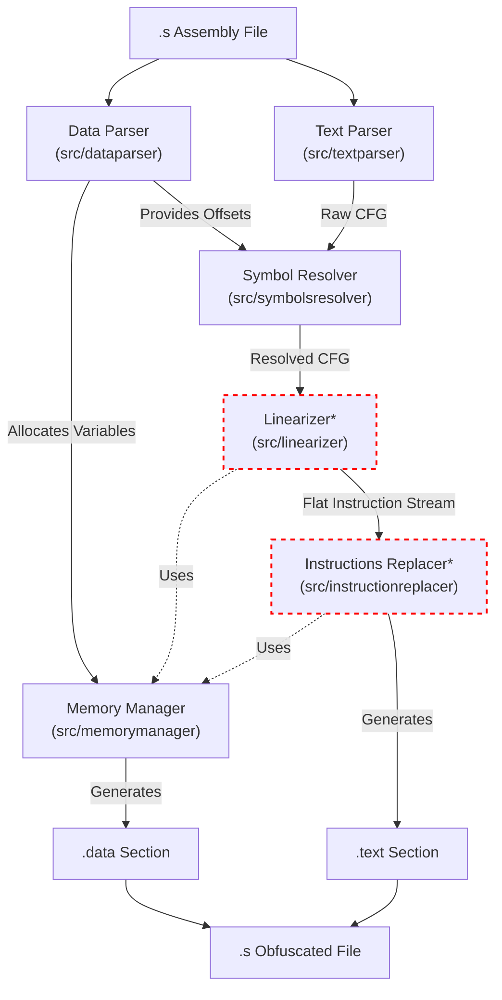

# Contributing to Movfuscator

Thank you for your interest in contributing to the **Movfuscator** project!
This document explains the architecture, testing process, and roadmap for the
unimplemented features.

## 1. Architecture Overview

The dependencies are structured linearly, with no circular dependencies and in
a layered fashion, essentially forming a pipeline.

### System Diagram



### Core Components

1.  **Memory Manager** (`src/memorymanager`): Helper class to allocate/initialize
memory into the .data section, used for both adding back existing variables and
internal use (e.g., scratch pads, lookup tables).
2.  **Data Parser** (`src/dataparser`): Parses `.data` section directives
(e.g., `.int`, `.asciz`) and registers them with the Memory Manager. Outputs a
dictionary of the parsed variables.
3.  **Text Parser** (`src/textparser`): Parses the `.text` section into a
Control Flow Graph (CFG). Encapsulates the assembly input into multiple useful
classes (`Function`, `Instruction`, `MemoryOperand`, `RegisterOperand`,
`ImmediateOperand`, `Expression`, etc.)
4.  **Symbol Resolver** (`src/symbolsresolver`): Combines the output of the two
parsers. It receives the variable map from the Data Parser and the CFG from the
Text Parser, replacing symbolic variable references with integer memory offsets
into the `.data` section.
5.  **Linearizer*** (`src/linearizer`): Responsible for flattening control flow.
It uses a dispatch variable to check whether a given code path should run or not.
Makes it so that instructions that shouldn't run write to a 'scratch' pointer
instead of real data. It also makes it so that conditional jump instructions
modify that dispatch variable, replacing the jump instructions with instructions
of other kind.
6.  **Instructions Replacer***: Responsible for replacing standard instructions
with `mov` sequences.
7.  **Movfuscator CLI** (`src/movfuscator`): This is the code for serializing
the outputs of the whole pipeline. The code for the CLI interface also lies
within this package.

Important: Components marked with an asterisk (*) are not currently implemented.
They fulfil their minimum function to progress through the pipeline, but they
do not perform any obfuscation logic.

---

## 2. Roadmap & Stubs

The following components are currently stubs (marked with `*`). Their
implementation is the primary goal of the project.

### The Linearizer* (`src/linearizer`)
The Linearizer is designed to implement **Control Flow Flattening**:
1.  **Jump Removal**: It replaces explicit jumps and conditional jumps 
(e.g., `je`, `jge`) to create a single linear execution path. In the end, it
should only utilize one jump instruction per function, looping over all instructions.
2.  **Code path faking**: It modifies instructions to support conditional logic
without branching.
    * It calls `MemoryManager` to allocate a **scratch pointer** and dummy memory page.
    * If a code path is "taken," instructions write to the real destination.
    * If "not taken," instructions write to the scratch page, ensuring no side effects.
    * Uses a variable to store the 'id' of the code path to execute this cycle
3. **Function exit**: We must figure out a way to return from the functions.
(Use the `ret` instruction as the global jmp? Have it so that it holds the r.a.
on exit and the top of the function otherwise?)

### The Instructions Replacer* (`src/instructionsreplacer`)
This module (to be implemented) performs the final obfuscation step:
1.  **Instruction Substitution**: It converts arithmetic and logic instructions
(e.g., `add`, `sub`, `xor`) into `mov` sequences.
2.  **Lookup Tables**: It calls `MemoryManager` to allocate static lookup tables
(e.g., for addition or boolean logic) to perform computation via data movement.

---

## 3. Testing

We use unit tests for modules only if it makes sense to do so. A lot of the
parsing logic is unit tested since it tends to be the most error-prone. Some
unit tests are snapshot tests. We also have end-to-end snapshot tests of the asm
files in the `tests/e2e/samples` directory. There is also a script
(`tests/e2e/run.sh`) to verify that the samples function identically before and
after movfuscation.

### Prerequisites
* **uv**: Used for dependency management and running the project.
* **GCC (32-bit)**: Required for compiling assembly samples during E2E tests.

### Running the CLI

```bash
uv run movfuscator --help
```

### Running Unit Tests
We use `pytest` with `syrupy` for snapshot testing to verify internal data
structures and parsing results.

```bash
uv run pytest -v
```

### Updating snapshots

```bash
uv run pytest --snaphsot-update
```

### Running E2E Tests
End-to-End tests ensure the obfuscated assembly functions identical to the
original. The script compiles the original code, compiles the obfuscated code,
runs both, and compares the output.

```bash
chmod +x tests/e2e/run.sh
uv run bash tests/e2e/run.sh
```

**Note**: The E2E script automatically looks for `.s` files in `tests/e2e/samples/`.

## 4. CI/CD
For all open PRs, there are automated checks for tests and other static analysis.
You should ensure the code is formatted with `uvx ruff format`, tests don't fail,
and `uvx ruff check` does not complain.
